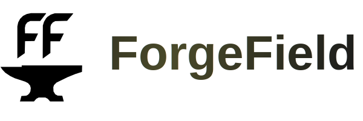

<p align="center">
  <picture>
    <source media="(prefers-color-scheme: dark)" srcset="logo-dark.svg"/>
    
  </picture>
</p>

# ForgeField

**Connect SKPORT with Google Apps Script and Discord for automation and notifications.**

ForgeField is a browser extension that links your [SKPORT](https://game.skport.com/endfield/sign-in) session to a Google Apps Script web app and optional Discord webhooks. Use it to trigger in-game claim automation, schedule daily claim reminders, and get Discord notifications—all without sharing your account credentials with third-party servers.

[](https://www.gnu.org/licenses/gpl-3.0)

---

## Features

- **SKPORT connection** — Detects when you’re signed in to the SKPORT website and shows connection status in the extension. Syncs your role from an open SKPORT tab so the extension knows which account is active.
- **Google account linking** — Sign in with Google to create and manage an Apps Script project. The extension deploys a small web app that runs your automation (e.g. claim triggers) and can be called from the extension or on a schedule.
- **Discord account linking** — Connect your Discord account so the extension can display your username and avatar. Optionally add a Discord webhook URL to send claim reminders or other notifications to a channel you choose.
- **One-click deployment** — The extension generates the Apps Script code and deploys it as a web app for you. You can open the script in the Google Apps Script editor anytime to view or edit it.
- **Enable Google Access** — After deployment, you grant the web app access once. The extension then uses that to run “Auto-claim Once” and to enable daily automation.
- **Auto-claim Once** — Trigger a single claim run by calling your deployed web app from the extension. Requires Google access to be enabled.
- **Daily Automation** — Set a daily time (e.g. 18:00) for the extension to remind you or for your script to run on a schedule. Stored in the extension; the actual scheduling depends on your Apps Script or external scheduler if you set one up.
- **Privacy-focused** — Tokens and preferences are stored only in your browser. No data is sent to the extension author’s servers.

---

## Supported Browsers

| Browser   | Support |
|----------|--------|
| Chrome   | Yes (Manifest V3) |
| Edge     | Yes |
| Brave    | Yes |
| Firefox  | Yes (Manifest V3, Gecko) |

Minimum versions: Chrome/Edge 88+, Firefox 109+.

---

## Installation

### From the browser store (when available)

- **Chrome:** [Chrome Web Store](https://chrome.google.com/webstore) — search for *ForgeField* (link TBD).
- **Edge:** [Microsoft Edge Add-ons](https://microsoftedge.microsoft.com/addons) — search for *ForgeField* (link TBD).
- **Firefox:** [Firefox Add-ons (AMO)](https://addons.mozilla.org) — search for *ForgeField* (link TBD).

### Load unpacked (development or pre-release)

1. **Download the extension**
   - Clone this repository, or download and extract the [latest release](https://github.com/DinasJ/ForgeField/releases) (or main branch) as a folder.

2. **Chrome / Edge / Brave**
   - Open `chrome://extensions` (or `edge://extensions`).
   - Turn on **Developer mode** (top right).
   - Click **Load unpacked** and select the folder that contains `manifest.json`.

3. **Firefox**
   - Open `about:debugging` → **This Firefox** → **Load Temporary Add-on**.
   - Choose the `manifest.json` file inside the extension folder.

4. **Pin the extension** (optional)  
   Click the puzzle piece (or extensions icon), find ForgeField, and pin it for quick access.

---

## Getting Started

### 1. Open the extension

Click the ForgeField icon in your browser toolbar to open the popup.

### 2. Connect SKPORT

- If you’re not already signed in, use the extension’s link to open the [SKPORT sign-in page](https://game.skport.com/endfield/sign-in).
- Sign in there, then return to the extension. With an SKPORT tab open (or after a recent sign-in), the extension can read your session and show **Connected**.
- The extension uses cookies and in-page storage from `*.skport.com` only to show connection status and sync your game role; it does not send this data elsewhere.

### 3. Link Google

- In the setup flow, choose to link your **Google account**.
- Sign in and grant the requested access (Apps Script, Drive for the script project). The extension will create an Apps Script project and deploy it as a web app.
- After deployment, open **Enable Google Access** and complete the one-time permission in the opened tab. This allows “Auto-claim Once” and daily automation to call your web app.

### 4. Link Discord (optional)

- In the setup flow, choose to link your **Discord account**. Authorize with the “identify” scope so the extension can show your username and avatar.
- Optionally, add a **Discord webhook URL** in the extension settings if you want notifications (e.g. claim reminders) sent to a channel you own.

### 5. Use the dashboard

- **Auto-claim Once** — Runs your deployed script once (e.g. to trigger a claim). Enable Google Access first.
- **View Generated Script** — Opens your Apps Script project in the browser so you can view or edit the code.
- **Daily Automation** — Set a time and enable daily automation; the extension stores your preference and uses it in combination with your script and optional webhook.

---

## Project Structure

```
ForgeField/
├── manifest.json       # Extension manifest (MV3)
├── background.js       # Service worker: OAuth, messaging, SKPORT cookie watcher
├── popup.html          # Popup UI structure
├── popup.js            # Popup logic, lifecycle, dashboard, deployment
├── popup.discord.js    # Discord UI and auth flow
├── popup.skport.js     # SKPORT / Google setup and status
├── style.css           # Styles and fonts
├── icons/              # Extension icons (16, 32, 48, 128)
├── fonts/              # HarmonyOS Sans (optional, for UI)
├── PRIVACY.md          # Privacy policy (for store listings)
├── PERMISSIONS.md      # Permission justifications for stores
└── README.md           # This file
```

No build step is required; the extension runs as-is from the folder.

---

## Permissions and Privacy

The extension requests only the permissions it needs:

- **Identity** — Google and Discord OAuth sign-in.
- **Storage** — Save linked accounts, preferences, and deployment state locally.
- **Cookies** — Read SKPORT session cookie to show SKPORT connection status.
- **Scripting / Tabs / Active tab** — Read game role from an open SKPORT tab and open sign-in/script/access pages when you click buttons.

Data is stored **only in your browser**. We do not collect or store your data on our own servers. For details, see [PRIVACY.md](PRIVACY.md). For short justification of each permission, see [PERMISSIONS.md](PERMISSIONS.md).

---

## Development

- **Load unpacked** from this repo (see [Installation](#installation)).
- **Popup console:** Right-click the extension icon → Inspect popup (or use the extension’s “Inspect” link on `chrome://extensions`).
- **Background:** On `chrome://extensions`, click “Service worker” under ForgeField to open the background script console.
- **Debug logging:** In `popup.js` and `background.js`, set `const DEBUG = true` at the top to enable console logging (leave `false` for production).

When changing OAuth or redirect behavior, ensure the redirect URIs in the [Discord Developer Portal](https://discord.com/developers/applications) and Google Cloud Console match the extension’s (e.g. `chrome.identity.getRedirectURL()` or the Firefox redirect origin used in code).

---

## License

This project is licensed under the **GNU General Public License v3.0**. See the [LICENSE](LICENSE) file for the full text. You may use, modify, and distribute the code under the terms of the GPL v3; derivative works must be disclosed and licensed under the same license.

---

## Contributing and Support

- **Bugs and feature requests:** Open an [issue](https://github.com/DinasJ/ForgeField/issues) on GitHub.
- **Code changes:** Fork the repo, make your changes, and open a pull request. By contributing, you agree that your contributions will be licensed under GPL v3.

If you use ForgeField and find it helpful, consider starring the repo or sharing it with other Endfield players.
